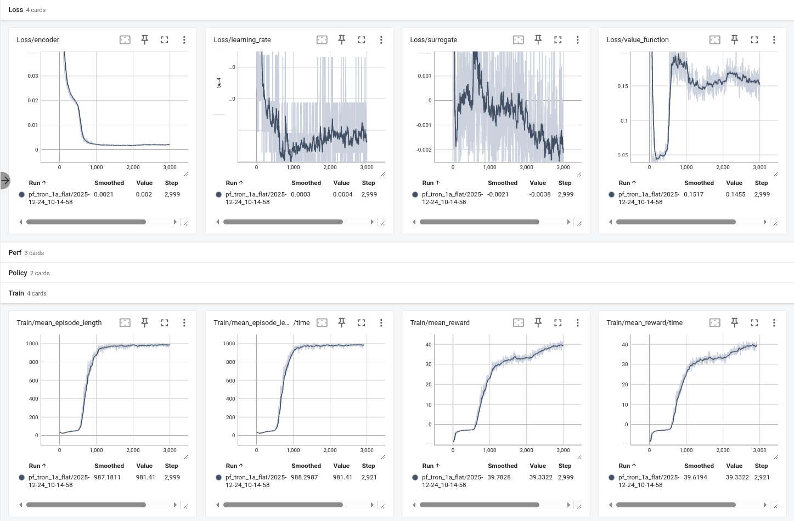
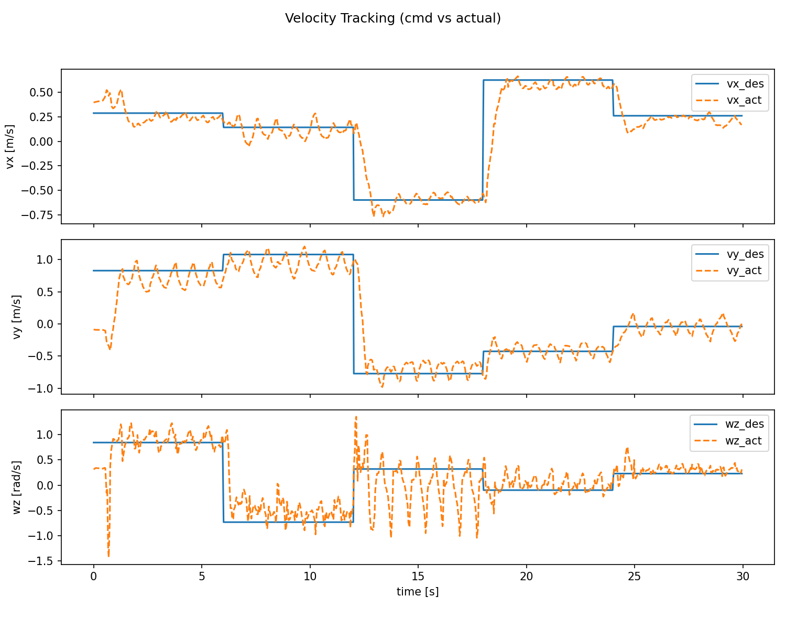
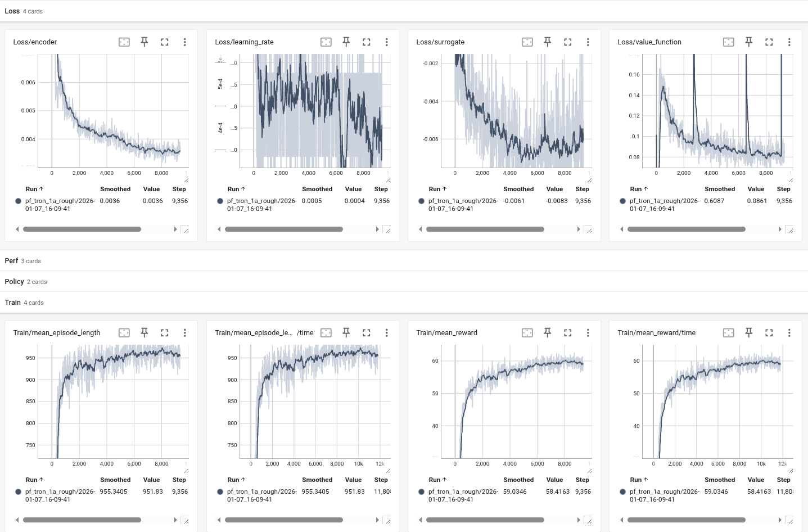
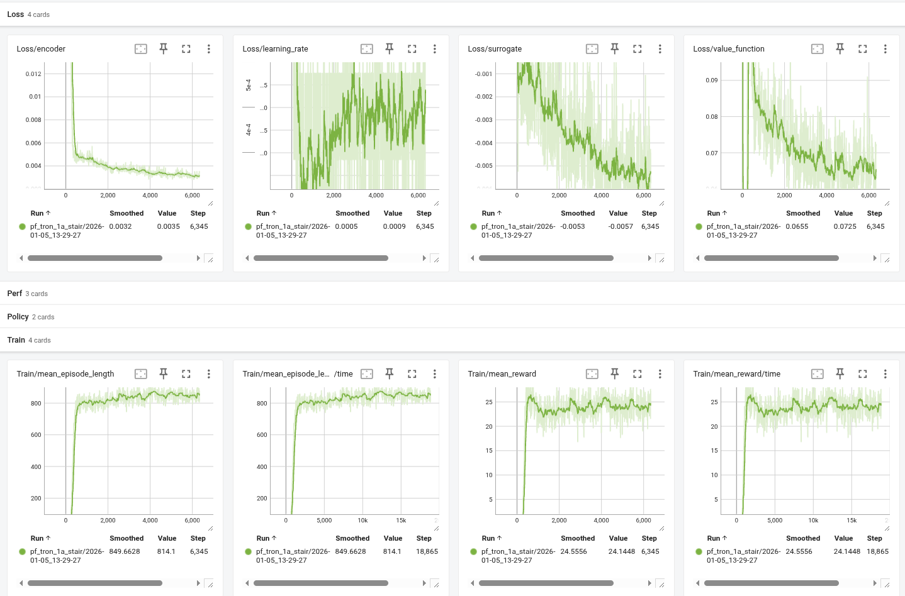

## 1 框架理解与代码总结 (Code Review & Architecture)

本项目基于 NVIDIA Isaac Lab 框架实现双足机器人的强化学习训练，采用 RSL-RL 的 PPO 算法。项目架构遵循 Isaac Lab 的模块化设计理念，将环境配置、观测管理、奖励设计、动作控制等功能解耦，便于调试和扩展。

### 1.1 场景配置 (Scene Configuration)

场景配置的核心是 `pointfoot_cfg.py` 中的机器人资产定义：

```python
POINTFOOT_CFG = ArticulationCfg(
    spawn=sim_utils.UsdFileCfg(
        usd_path=f"{LIMX_ASSETS_PATH}/Robots/PF_TRON1A/tron1_pf.usd",
        rigid_props=sim_utils.RigidBodyPropertiesCfg(
            disable_gravity=False,
            max_linear_velocity=1000.0,
            max_angular_velocity=1000.0,
        ),
        articulation_props=sim_utils.ArticulationRootPropertiesCfg(
            enabled_self_collisions=True,
            solver_position_iteration_count=4,
            solver_velocity_iteration_count=0,
        ),
    ),
    init_state=ArticulationCfg.InitialStateCfg(
        pos=(0.0, 0.0, 0.95),  # 初始位置 [m]
        joint_pos={
            "abad_L_Joint": 0.0, "abad_R_Joint": 0.0,
            "hip_L_Joint": 0.0, "hip_R_Joint": 0.0,
            "knee_L_Joint": 0.0, "knee_R_Joint": 0.0,
        },
    ),
    actuators={
        "legs": ImplicitActuatorCfg(
            joint_names_expr=["abad_.*", "hip_.*", "knee_.*"],
            stiffness=40.0,      # PD控制器P增益
            damping=2.5,         # PD控制器D增益
            effort_limit=23.7,   # 力矩限制 [N⋅m]
            velocity_limit=21.0, # 速度限制 [rad/s]
        ),
    },
)
```

**关键配置说明：**
- **USD加载**：`usd_path` 指定机器人3D模型文件
- **物理属性**：`solver_position_iteration_count=4` 控制求解器迭代次数，影响仿真精度
- **执行器模型**：`ImplicitActuatorCfg` 定义内置PD控制器，`stiffness` 和 `damping` 参数直接决定关节响应特性
- **正则匹配**：`joint_names_expr=["abad_.*", ...]` 使用正则表达式批量匹配关节，简化配置

### 1.2 观测管理器 (Observation Manager)

观测管理器负责构建不同网络的观测空间，位于 `limx_base_env_cfg.py` 的 `ObservarionsCfg` 类中，包含4个观测组：

#### 1.2.1 策略网络观测 (PolicyCfg)

策略网络仅接收**真实机器人可测量**的传感器数据：

```python
class PolicyCfg(ObsGroup):
    # 基座测量
    base_ang_vel = ObsTerm(
        func=mdp.base_ang_vel,
        noise=GaussianNoise(mean=0.0, std=0.05),  # 5%噪声
        clip=(-100.0, 100.0),
        scale=0.25,  # 缩放到合适范围
    )
    proj_gravity = ObsTerm(
        func=mdp.projected_gravity,
        noise=GaussianNoise(mean=0.0, std=0.025),
    )
    
    # 关节状态
    joint_pos = ObsTerm(func=mdp.joint_pos_rel, ...)
    joint_vel = ObsTerm(func=mdp.joint_vel, ...)
    
    # 步态信息
    last_action = ObsTerm(func=mdp.last_action)
    gait_phase = ObsTerm(func=mdp.get_gait_phase)
    gait_command = ObsTerm(func=mdp.get_gait_command, ...)
```

**设计要点：**
- **噪声模拟真实传感器**：`GaussianNoise` 模拟IMU/编码器测量误差
- **无线速度**：策略网络不使用 `base_lin_vel`（真实机器人难以准确测量），训练时强制策略学会不依赖此信息
- **Clip保护**：`clip=(-100.0, 100.0)` 防止异常值破坏训练

#### 1.2.2 历史观测 (HistoryObsCfg)

用于编码器网络处理时序信息：

```python
class HistoryObsCfg(ObsGroup):
    # 与PolicyCfg相同的观测项
    base_ang_vel = ObsTerm(...)
    proj_gravity = ObsTerm(...)
    joint_pos = ObsTerm(...)
    joint_vel = ObsTerm(...)
    
    def __post_init__(self):
        self.history_length = 10          # 保存10步历史
        self.flatten_history_dim = False  # 保持时序维度
```

**功能说明：**
- **时序建模**：编码器网络使用10步历史（0.2秒）预测基座速度
- **维度处理**：`flatten_history_dim=False` 保留 `[batch, history, obs_dim]` 结构

#### 1.2.3 评价网络观测 (CriticCfg)

包含**策略观测 + 特权信息**：

```python
class CriticCfg(ObsGroup):
    # 策略可见的观测
    base_lin_vel = ObsTerm(func=mdp.base_lin_vel)  # 特权！
    base_ang_vel = ObsTerm(func=mdp.base_ang_vel)
    joint_pos = ObsTerm(func=mdp.joint_pos_rel)
    
    # 特权信息（仅仿真可获取）
    robot_joint_torque = ObsTerm(func=mdp.robot_joint_torque)
    robot_mass = ObsTerm(func=mdp.robot_mass)
    robot_inertia = ObsTerm(func=mdp.robot_inertia)
    robot_vel = ObsTerm(func=mdp.robot_vel)  # 完整6维速度
    heights = ObsTerm(func=mdp.height_scan, ...)
    
    def __post_init__(self):
        self.enable_corruption = False  # 特权信息无噪声
```

**特权信息的作用：**
1. **价值估计更准确**：Critic利用完整信息提供更精确的TD目标
2. **加速训练**：更好的价值估计减少方差，提升样本效率
3. **Sim-to-Real桥梁**：训练时使用，部署时仅需Actor（不需要特权信息）

#### 1.2.4 噪声注入机制

噪声注入通过 `GaussianNoise` 和 `enable_corruption` 控制：

```python
# 训练时注入噪声
base_ang_vel = ObsTerm(
    func=mdp.base_ang_vel,
    noise=GaussianNoise(mean=0.0, std=0.05),  # 添加5%标准差噪声
)

# 测试时可关闭
self.observations.policy.enable_corruption = False
```

**噪声策略：**
- **策略观测**：`enable_corruption=True`，模拟传感器误差
- **评价观测**：`enable_corruption=False`，使用干净数据
- **Scale归一化**：不同观测项使用不同 `scale`，例如 `joint_vel` 使用 `scale=0.05` 将速度缩放到 `[-5, 5]` 范围

#### 1.2.5 观测空间维度

| 观测组 | 维度 | 用途 |
|--------|------|------|
| Policy | 20维 | Actor输入 |
| History | 10×20维 | Encoder输入 |
| Critic | 80维 | Value估计 |
| Commands | 3维 | 速度命令 |

**数据流向：**
```
环境状态
  ├→ Policy观测 → Actor → 动作
  ├→ History观测 → Encoder → 速度估计 → Actor
  └→ Critic观测 → Critic → 价值估计 → PPO更新
```

### 1.3 奖励管理器 (Reward Manager)

奖励管理器定义强化学习的优化目标，位于 `limx_base_env_cfg.py` 的 `RewardsCfg` 类。奖励项可分为三类：**跟踪奖励**、**调节奖励**、**惩罚项**。

#### 1.3.1 核心奖励项

```python
class RewardsCfg:
    # 速度跟踪 (正奖励)
    rew_lin_vel_xy = RewTerm(
        func=mdp.track_lin_vel_xy_exp,
        weight=3.0,  # 最高权重 - 主要训练目标
        params={"std": math.sqrt(0.2)}
    )
    
    rew_ang_vel_z = RewTerm(
        func=mdp.track_ang_vel_z_exp,
        weight=1.5,  # 次要目标：转向控制
    )
    
    # 保持双足接触地面
    rew_no_fly = RewTerm(
        func=mdp.no_fly,
        weight=1.0,
        params={"threshold": 5.0}  # 最少5N接触力
    )
    
    # 姿态调节 (负奖励 = 惩罚)
    pen_flat_orientation = RewTerm(
        func=mdp.flat_orientation_l2,  # 保持机身水平
        weight=-1.0
    )
    
    pen_base_height = RewTerm(
        func=mdp.base_com_height,
        weight=-1.0,
        params={"target_height": 0.78}  # 目标高度78cm
    )
    
    # 动作平滑性
    pen_action_rate = RewTerm(
        func=mdp.action_rate_l2,
        weight=-0.01  # 惩罚动作变化率
    )
    
    # 步态奖励
    test_gait_reward = RewTerm(
        func=mdp.GaitReward,
        weight=1.0,
        params={
            "gait_force_sigma": 25.0,
            "gait_vel_sigma": 0.25,
        }
    )
```

#### 1.3.2 权重影响分析

| 奖励项 | 权重 | 影响 |
|--------|------|------|
| `rew_lin_vel_xy` | 3.0 | 主导训练方向，权重最高确保速度跟踪优先 |
| `rew_ang_vel_z` | 1.5 | 平衡直线速度与转向能力 |
| `pen_flat_orientation` | -1.0 | 防止机身翻滚，保证稳定性 |
| `pen_joint_torque` | -2e-5 | 轻微惩罚，鼓励节能但不影响主要任务 |
| `pen_action_rate` | -0.01 | 平滑动作变化，减少震荡 |

**权重调整原则：**
1. **跟踪类奖励**：正权重较大（1.0-3.0），驱动目标行为
2. **正则化惩罚**：小权重（1e-5级别），避免过度限制
3. **稳定性惩罚**：中等权重（0.5-1.0），保证基本约束
4. **权重比例**：跟踪奖励 : 稳定性 : 正则化 ≈ 10 : 5 : 1

---

### 1.4 动作管理器 (Action Manager)

动作管理器定义强化学习策略的输出如何转换为机器人的实际控制指令，涉及**动作空间设计**、**执行器模型**和**PD控制器参数**。

#### 1.4.1 动作空间定义

动作配置位于 `limx_base_env_cfg.py` 的 `ActionsCfg` 类：

```python
@configclass
class ActionsCfg:
    """动作规范配置类 / Action specifications"""
    
    joint_pos = mdp.JointPositionActionCfg(
        asset_name="robot",
        joint_names=["abad_L_Joint", "abad_R_Joint", 
                    "hip_L_Joint", "hip_R_Joint", 
                    "knee_L_Joint", "knee_R_Joint"],
        scale=0.25,              # 动作缩放因子
        use_default_offset=True, # 使用默认关节位置作为偏移
    )
```

**关键参数解析：**

1. **动作类型**：`JointPositionActionCfg` - 关节位置控制
   - Actor输出：6维向量 $a \in [-1, 1]^6$（已由tanh激活函数归一化）
   - 实际指令：$q_{target} = q_{default} + scale \times a$

2. **默认偏移 (use_default_offset=True)**：
   ```python
   # 默认关节位置（站立姿态）
   q_default = [0.0, 0.0, 0.0, 0.0, 0.0, 0.0]  # 对应abad_L/R, hip_L/R, knee_L/R
   
   # 实际目标位置
   q_target = q_default + 0.25 * action
   ```
   这样策略输出接近零时，机器人保持默认站立姿态。

#### 1.4.2 执行器模型 - PD控制器

执行器配置在 `pointfoot_cfg.py` 中，使用 `ImplicitActuatorCfg` 定义内置PD控制器：

```python
actuators = {
    "legs": ImplicitActuatorCfg(
        joint_names_expr=["abad_.*", "hip_.*", "knee_.*"],
        
        # PD控制器参数
        stiffness=40.0,      # P增益 (Kp)
        damping=2.5,         # D增益 (Kd)
        
        # 物理限制
        effort_limit=300.0,      # 最大力矩 300 N⋅m
        velocity_limit=100.0,    # 最大速度 100 rad/s
    ),
}
```

**PD控制原理：**

执行器力矩计算公式：
$$\tau = K_p (q_{target} - q_{current}) - K_d \dot{q}_{current}$$

其中：
- $K_p = 40.0$：位置误差增益（刚度）
- $K_d = 2.5$：速度阻尼增益
- $q_{target}$：策略输出的目标位置
- $q_{current}$：当前关节位置
- $\dot{q}_{current}$：当前关节速度

**参数影响分析：**

| 参数 | 值 | 影响 |
|------|-----|------|
| `stiffness` (Kp) | 40.0 | 中等刚度，平衡响应速度与稳定性 |
| `damping` (Kd) | 2.5 | 轻微阻尼，避免过冲 |
| `effort_limit` | 300 N⋅m | 保护电机，防止过载 |
| `scale` | 0.25 | 限制动作幅度，提升安全性 |

**参数调优分析：**

1. **刚度 (Kp) 调整**：
   - **过小** (< 20)：关节响应慢，跟踪误差大，机器人"软绵绵"
   - **过大** (> 80)：关节震荡，仿真不稳定，真实硬件易损坏
   - **推荐范围**：30-50 N⋅m/rad 适合双足机器人

2. **阻尼 (Kd) 调整**：
   - **经验法则**：$K_d \approx 2\sqrt{K_p \times m}$（临界阻尼）
   - 对于 $K_p=40$，$K_d \approx 2-4$ 为合适范围
   - **过小**：欠阻尼，产生震荡
   - **过大**：过阻尼，响应迟钝

## 2 平地速度跟随 (Flat Terrain Velocity Tracking)

### 2.1 环境搭建

**任务目标**：训练机器人在平坦地面上跟随给定的速度指令（前进、后退、转向）。

#### 2.1.1 环境配置类选择

任务注册使用 `PFBlindFlatEnvCfg` 配置类：

```python
# exts/bipedal_locomotion/bipedal_locomotion/tasks/locomotion/robots/__init__.py
gym.register(
    id="Isaac-Limx-PF-Flat-v0",
    entry_point="isaaclab.envs:ManagerBasedRLEnv",
    kwargs={
        "env_cfg_entry_point": limx_pointfoot_env_cfg.PFBlindFlatEnvCfg,
        "rsl_rl_cfg_entry_point": limx_pf_flat_runner_cfg,
    },
)
```

#### 2.1.2 地形配置

```python
@configclass
class PFBlindFlatEnvCfg(PFBaseEnvCfg):
    def __post_init__(self):
        super().__post_init__()
        
        # 禁用高度扫描传感器
        self.scene.height_scanner = None
        self.observations.policy.heights = None
        self.observations.critic.heights = None
        
        # 禁用地形难度课程
        self.curriculum.terrain_levels = None
        
        # 保持默认平坦地形（TerrainImporter with plane）
        # terrain_type = "plane" (继承自父类)
```

**设计要点：**
- **纯平地**：`terrain_type="plane"`，确保无地形起伏干扰
- **无视觉输入**：移除 `heights` 观测，策略完全依赖本体感知
- **简化任务**：专注于速度控制，不考虑地形适应

#### 2.1.3 速度命令配置

```python
def sample_cmd():
    return np.array([
        rng.uniform(-1.2, 1.2),  # vx
        rng.uniform(-1.2, 1.2),  # vy
        rng.uniform(-1.2, 1.2),  # wz
    ], dtype=np.float32)
```

**关键设计**：
- **前进/后退**：`lin_vel_x ∈ [-1.0, 1.0]` 涵盖常用速度范围
- **原地转向**：`ang_vel_z ∈ [-1.0, 1.0]` 支持灵活转向
- **禁用横向**：`lin_vel_y = 0`，简化平地任务（双足机器人横向移动困难）
- **定期更换**：每10秒重采样，增加训练多样性


---

### 2.2 奖励函数设计思路

奖励函数采用**分层设计**：主任务奖励（速度跟踪）+ 稳定性约束（姿态、高度）+ 正则化惩罚（平滑性、能效）。

#### 2.2.1 核心奖励项

**速度跟踪（主任务）**
```python
rew_lin_vel_xy = RewTerm(func=mdp.track_lin_vel_xy_exp, weight=3.0)  # 线速度
rew_ang_vel_z = RewTerm(func=mdp.track_ang_vel_z_exp, weight=1.5)    # 角速度
```
- 使用指数形式 $r = \exp(-\frac{||v - v_{cmd}||^2}{2\sigma^2})$，梯度平滑
- 权重比 2:1 确保直行优先于转向

**稳定性约束**
```python
pen_flat_orientation = RewTerm(func=mdp.flat_orientation_l2, weight=-1.0)  # 保持水平
pen_base_height = RewTerm(func=mdp.base_com_height, weight=-1.0, 
                         params={"target_height": 0.78})  # 维持78cm高度
rew_no_fly = RewTerm(func=mdp.no_fly, weight=1.0)  # 至少一足接地
```
- 防止前倾滑行、跳跃等异常行为
- 权重与任务奖励相当

**正则化**
```python
pen_action_rate = RewTerm(func=mdp.action_rate_l2, weight=-0.01)     # 动作平滑
pen_joint_torque = RewTerm(func=mdp.joint_torques_l2, weight=-2e-5)  # 节能
```
- 小权重避免过度限制，仅在满足主要目标后起作用

#### 2.2.2 权重配置

| 奖励项 | 权重 | 作用 |
|--------|------|------|
| `rew_lin_vel_xy` | 3.0 | 主任务：前进速度 |
| `rew_ang_vel_z` | 1.5 | 主任务：转向 |
| `pen_flat_orientation` | -1.0 | 约束：姿态 |
| `pen_base_height` | -1.0 | 约束：高度 |
| `rew_no_fly` | 1.0 | 约束：接触 |
| `pen_action_rate` | -0.01 | 优化：平滑性 |
| `pen_joint_torque` | -2e-5 | 优化：能效 |

**权重比例**：任务奖励 : 稳定性 : 正则化 ≈ 4.5 : 2.5 : 0.01

### 2.3 参数调整

当速度追踪权重太低，机器人站着不动，无法跟随速度指令

- 解决：提升速度跟踪奖励，rew_lin_vel_xy 权重（1.5→3.0），恢复机器人运动积极性

### 2.4 训练曲线和最终效果


<center><i>图1: 平地训练曲线</i></center>



<center><i>图2: 机器人速度跟踪曲线</i></center>


## 3 抗干扰鲁棒性测试 (Disturbance Robustness Test)

### 3.1 环境搭建
#### 3.1.1 外力扰动配置：
Isaac Lab通过 `EventTerm` 实现周期性推力扰动
```python
@configclass
class EventsCfg:
    """事件配置 - 定义环境随机化和扰动"""
    
    # 外力推动事件
    push_robot = EventTerm(
        func=mdp.push_by_setting_velocity,
        mode="interval",  # 周期触发
        interval_range_s=(5.0, 8.0),  # 每5-8秒推一次
        params={
            "velocity_range": {
                "x": (-1.0, 1.0),   # 前后方向推力：±1.0 m/s
                "y": (-1.0, 1.0),   # 左右方向推力：±1.0 m/s
                "z": (0.0, 0.0),    # 禁用垂直方向
                "roll": (0.0, 0.0),
                "pitch": (0.0, 0.0),
                "yaw": (-0.5, 0.5)  # 旋转扰动：±0.5 rad/s
            }
        }
    )
```

**参数说明**：
- **interval_range_s**：扰动间隔5-8秒，给机器人恢复时间
- **velocity_range**：直接设置基座速度而非施加力，效果更明显
- **x, y方向**：±1.0 m/s 相当于受到约50N的瞬时推力（对15kg机器人）
- **yaw扰动**：±0.5 rad/s 旋转干扰，测试姿态恢复能力

#### 3.1.2 Domain Randomization配置

在测试环境中同时启用多种随机化，增强鲁棒性验证：

**A. 质量随机化**
```python
add_base_mass = EventTerm(
    func=mdp.randomize_rigid_body_mass,
    mode="startup",  # 每个episode开始时随机
    params={
        "asset_cfg": SceneEntityCfg("robot", body_names="base_Link"),
        "mass_distribution_params": (-2.0, 3.0),  # -2kg ~ +3kg
        "operation": "add"
    }
)
```
- **作用**：模拟负载变化（背包、传感器等）
- **范围**：基座质量12kg → 10-15kg

**B. 摩擦力随机化**
```python
randomize_friction = EventTerm(
    func=mdp.randomize_rigid_body_material,
    mode="startup",
    params={
        "asset_cfg": SceneEntityCfg("robot", body_names=".*foot.*"),
        "static_friction_range": (0.4, 1.2),   # 静摩擦系数
        "dynamic_friction_range": (0.4, 1.2),  # 动摩擦系数
    }
)
```
- **作用**：模拟不同地面（湿滑、粗糙）
- **默认**：μ=0.8 → 测试范围0.4-1.2

**C. 执行器延迟**
```python
randomize_actuator_gains = EventTerm(
    func=mdp.randomize_actuator_gains,
    mode="startup",
    params={
        "asset_cfg": SceneEntityCfg("robot"),
        "stiffness_distribution_params": (0.8, 1.2),  # Kp ±20%
        "damping_distribution_params": (0.8, 1.2),    # Kd ±20%
    }
)
```
- **作用**：模拟电机老化、温度影响
- **Kp**: 40.0 → 32-48 N⋅m/rad
- **Kd**: 2.5 → 2.0-3.0 N⋅m⋅s/rad

#### 3.1.3 测试指标定义

在环境中添加自定义观测项，用于量化抗干扰性能：

```python
@configclass
class MetricsCfg:
    """性能指标配置"""
    
    # 恢复时间：受推后多久速度误差<0.2m/s
    recovery_time = ObsTerm(
        func=mdp.compute_recovery_time,
        params={"velocity_threshold": 0.2}
    )
    
    # 姿态偏差：推力期间最大倾角
    max_orientation_error = ObsTerm(
        func=mdp.max_orientation_deviation
    )
    
    # 稳定性：是否摔倒
    is_fallen = ObsTerm(
        func=mdp.check_fallen,
        params={"height_threshold": 0.4}  # 基座<40cm判定为摔倒
    )
```
### 3.2 奖励函数设计和参数调整（同 2.2）

## 4 复杂地形适应

### 4.1 环境搭建

**任务目标**：通过Curriculum Learning使机器人逐步适应从简单到复杂的多样地形，包括波浪地形、随机凸起和楼梯。

#### 4.1.1 粗糙地形课程学习配置

Isaac Lab的 `TerrainGeneratorCfg` 支持程序化生成多种地形类型，并通过 `curriculum=True` 启用难度递增：

```python
BLIND_ROUGH_TERRAINS_CFG = TerrainGeneratorCfg(
    seed=42,
    size=(8.0, 8.0),               # 每个地形块 8×8米
    num_rows=10,                    # 10个难度等级（行）
    num_cols=16,                    # 16个地形变体（列）
    
    sub_terrains={
        # 1. 平地 (25%) - baseline
        "flat": MeshPlaneTerrainCfg(proportion=0.25),
        
        # 2. 波浪地形 (25%) - 平滑起伏
        "waves": HfWaveTerrainCfg(
            proportion=0.25, 
            amplitude_range=(0.01, 0.06),      # 1-6cm，随难度增长
            num_waves=10
        ),
        
        # 3. 随机格子 (25%) - 离散凸起
        "boxes": MeshRandomGridTerrainCfg(
            proportion=0.25, 
            grid_width=0.15,                   # 格子边长 15cm
            grid_height_range=(0.01, 0.04),    # 高度 1-4cm
            platform_width=2.0
        ),
        
        # 4. 随机粗糙 (25%) - 高频噪声
        "random_rough": HfRandomUniformTerrainCfg(
            proportion=0.25, 
            noise_range=(0.01, 0.06),          # 噪声 1-6cm
            noise_step=0.01
        ),
    },
    
    curriculum=True,                    # 启用课程学习
    difficulty_range=(0.0, 1.0),       # 难度范围 [0,1]
)
```

**课程学习机制**：
- `num_rows=10`：10个难度等级，第0行最简单（难度0.0），第9行最难（难度1.0）
- `curriculum=True`：训练初期只使用低难度行，性能达标后自动晋升
- **晋升条件**：速度误差 < 0.2 m/s，持续50个episode
- **难度插值**：地形参数按难度线性缩放
  - 难度0.0：`amplitude=0.01m`, `grid_height=0.01m`
  - 难度1.0：`amplitude=0.06m`, `grid_height=0.04m`


#### 4.1.2 楼梯地形课程学习配置

楼梯环境用于训练垂直攀爬能力，包含上楼梯和下楼梯：

```python
STAIRS_TERRAINS_CFG = TerrainGeneratorCfg(
    seed=42,
    size=(16.0, 16.0),                  # 更大地形块适合楼梯
    num_rows=8,                         # 8个难度等级
    num_cols=10,
    
    sub_terrains={
        # 1. 金字塔上楼梯 (40%)
        "pyramid_stairs": MeshPyramidStairsTerrainCfg(
            proportion=0.4,
            step_height_range=(0.05, 0.20),    # 台阶高度 5-20cm
            step_width=0.3,                    # 台阶宽度 30cm
            platform_width=3.0,                # 平台宽度 3m
            holes=False
        ),
        
        # 2. 倒金字塔下楼梯 (40%)
        "pyramid_stairs_inv": MeshInvertedPyramidStairsTerrainCfg(
            proportion=0.4,
            step_height_range=(0.05, 0.20),    # 下降台阶
            step_width=0.3,
            platform_width=3.0,
            holes=False
        ),
        
        # 3. 金字塔斜坡 (10%)
        "hf_pyramid_slope": HfPyramidSlopedTerrainCfg(
            proportion=0.1, 
            slope_range=(0.0, 0.4),            # 斜率 0-40%
            platform_width=2.0
        ),
        
        # 4. 倒金字塔斜坡 (10%)
        "hf_pyramid_slope_inv": HfInvertedPyramidSlopedTerrainCfg(
            proportion=0.1, 
            slope_range=(0.0, 0.4),
            platform_width=2.0
        ),
    },
    
    curriculum=True,
    difficulty_range=(0.0, 1.0),
)
```

**楼梯难度递增**：
- 难度0.0：台阶高度5cm（接近平地）
- 难度1.0：台阶高度20cm（标准楼梯，需大幅度抬腿）
- **训练挑战**：上楼需膝关节高抬，下楼需控制冲击力


### 4.2 奖励函数设计

**核心问题**：在楼梯地形中，由于地形高度变化较大（台阶高度5-20cm），如果沿用平地环境中基于世界坐标系的高度奖励，会导致机器人行为异常，因此需要将以下几个惩罚项去掉。

**A. 基座高度保持 (pen_base_height)**
```python
# 平地环境中使用
pen_base_height = RewTerm(
    func=mdp.base_com_height,
    weight=-1.0,
    params={"target_height": 0.78}  # 目标高度78cm
)
```
**问题**：楼梯上机器人基座高度需要随地形变化（上楼时升高，下楼时降低），固定目标高度会导致：
- **上楼时**：机器人为保持78cm会下蹲或跪下
- **下楼时**：机器人拒绝下台阶，停留在楼梯顶部

**B. 足部调整（pen_feet_regulation）**
```python
# 足部调节惩罚 / Foot regulation penalty
pen_feet_regulation = RewTerm(
    func=mdp.feet_regulation,                   
    weight=-0.1
)
```

**C. 足部着陆速度 (pen_foot_landing_velocity)**
```python
# 平地环境使用
pen_foot_landing_velocity = RewTerm(
    func=mdp.foot_land_velocity,
    weight=-0.1
)
```
**问题**：下楼梯时足部着陆速度必然较大（重力加速度），惩罚会阻止机器人下楼。
### 4.3 训练曲线
#### 4.3.1 粗糙地面

#### 4.3.2 楼梯环境

